# Jenkins-slack-bot 

> Slackbot for Jenkins Server.

Operation bot for running Jenkins job from slack.

## Bot Setup

- Login into Workspace

    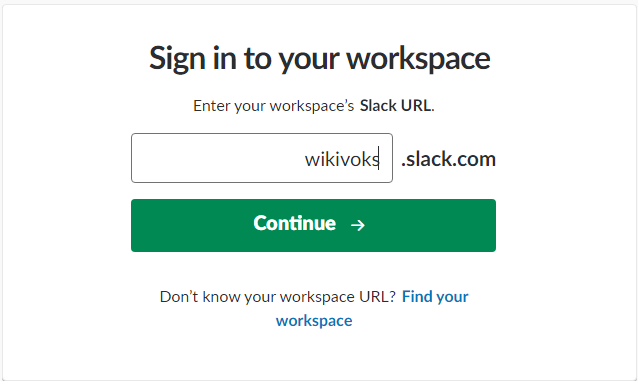

- Create bot - Go to [slack-apps](https://api.slack.com/slack-apps) and Go to "Your Apps" or [Apps](https://api.slack.com/apps)

    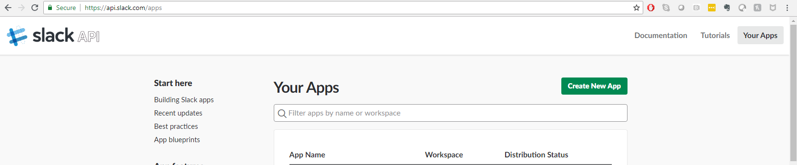

- Name the bot - Give name and add bot to workspace where you want to deploy

    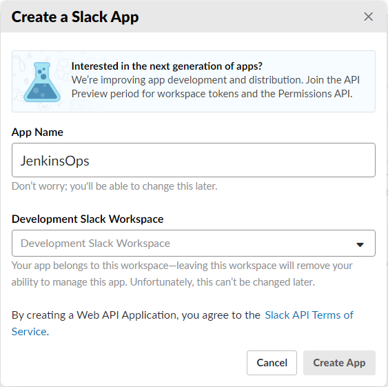

- Enable Incoming Webhooks

    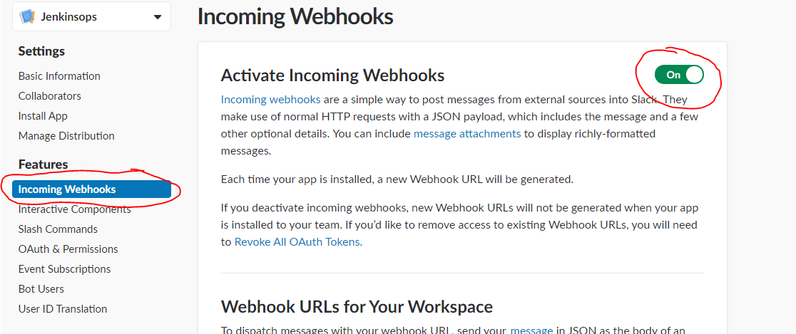

- Install App to Workspace and select channel where you want to authorize. 

    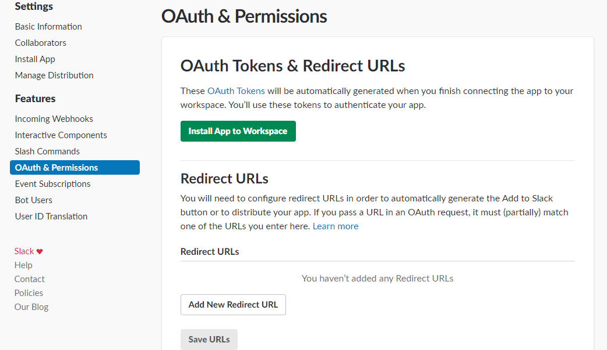

- Get Bot User OAuth Access Token

    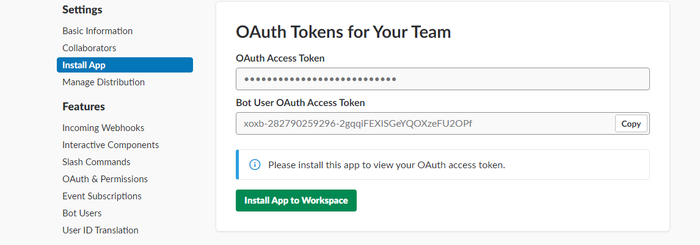

## Jenkins

- Install Jenkins and Make sure it's up and running. *Note: I am using Linux machine for Jenkins*

- Clone this repo to server where you want to run bot.

- Add environment variables to server. *[HOW: Add to profile](https://help.ubuntu.com/community/EnvironmentVariables)*
    - JENKINS_HOST - Export JENKINS host name to this Variable
    - JENKINS_PORT - Port number of Jenkins service
    - JENKINS_USER - User who has access to jenkins
    - JENKINS_TOKEN - *[Get API token for JENKINS_USER](https://support.cloudbees.com/hc/en-us/articles/115003090592-How-to-re-generate-my-Jenkins-user-token)*
    - SLACK_API_TOKEN - Bot User OAuth Access Token

    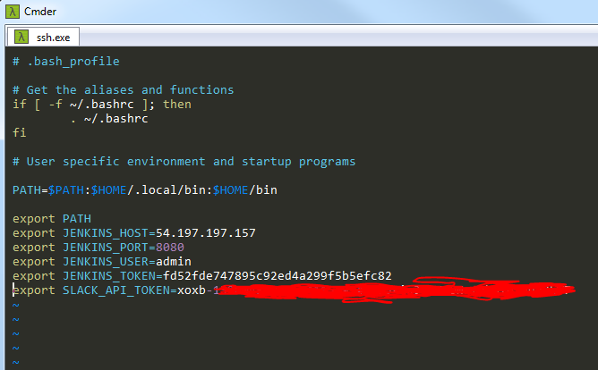

- Make sure python is installed on server.

    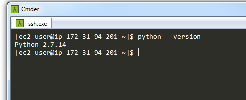

- Change directory to location of [bot.py](slackbot/bot.py)

- Run Python script on server. 
    - You will see "Successfully connected" 
    - And list of jobs in Jenkins server

    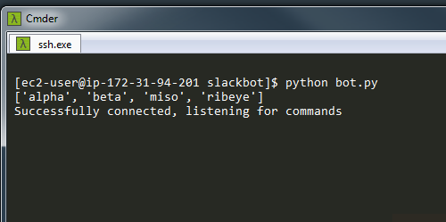

## Scope for this Project

- You can build jenkins jobs with one parameter as "Ops" 
    > *You can customize script to accept multiple commads*
- In current script:
    - Accepted commands
        - start/stop/restart/action
    - Service
        - All jenkins jobs in machine
- When you call jenkins from slack
    - It will validate commands you passed with set of commands in script
    - It will validate whether service/Jenkins job is exit
    - It will post help command when any of the commands or job doesn't exist

    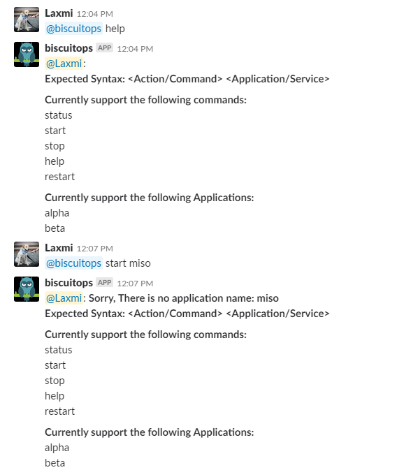
    
    > *Note: BiscuitOps is my test Bot. I did created sample job (alpha, beta) jenkins jobs on my local jenkins server.

    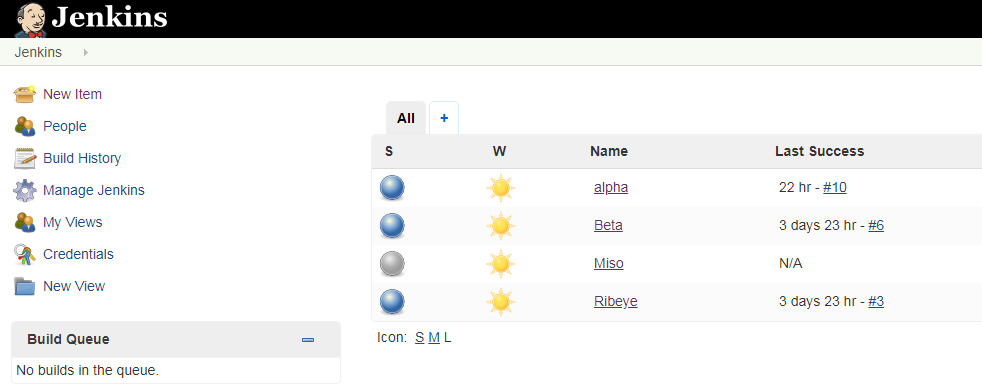

## Running bot as service

This will help running bot as service on Linux server:

- Create service file on server
    > sudo vi /lib/systemd/system/jenkinsops.service
- Check [Service file template](service/jenkinsops.service)
- Create Conf file *if required* [Check Conf file template](service/bot.conf)
- Run below commands
    > sudo systemctl daemon-reload

    > sudo systemctl start jenkinsops.service - for starting service

    > sudo systemctl start jenkinsops.service - Check status of service

## Contribute

Contributions are always welcome!

## License

MIT License

Copyright (c) 2018 Lakshmi Ravipati